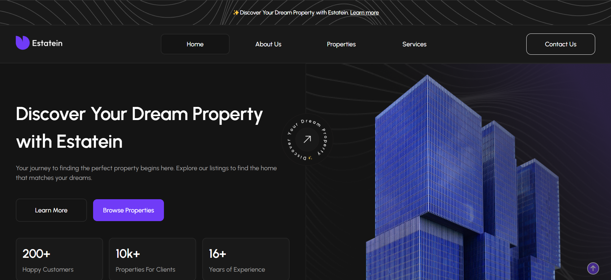
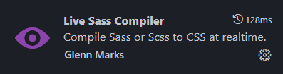

#  ESTATEIN - Real Estate Agency</br>(Frontend + Backend project)

The creation of this project carries the idea of ​​​​applying knowledge of **Front** and **Back development**.

>In the past, while working in marketing, I had a lot of experience working with real estate agencies. 
</br>*So the idea for my project did not take long to arrive.*

**This site is a platform for providing clients with up-to-date information and attracting new clients.**

**Using this website, the agency can:**
* Receive a sorted list of leads from forms on the website.
* Receive a list of unprocessed leads and change their status after processing.
* Download a file with a list of all emails received from forms for further use for marketing purposes.
* View and edit the list and characteristics of real estate displayed on the site.
* Add and remove real estate objects to/from the site.
* View, edit, delete and add users to site management.



**[==> View website]() Coming soon...**

**[==> View Figma](https://www.figma.com/design/mkozkfJX2EGUIFcbl43EuD/Real-Estate-Business-Website?node-id=45-2&t=EVNNFlmQPORgXUVz-1)**

**[==> Learn more about the admin panel](./assets/docs/ADMIN.md)**

**[==> View conceptual model of database](./assets/docs/images/sql_model.png)**

## Summary

* [Philosophy](#philosophy)
* [Licence](#licence)
* [Tools](#tools)
* [Installation](#installation)
* [Versions](#my-versions)

## Philosophy

I tried to adhere to two main principles:

* [BDUF](https://en.wikipedia.org/wiki/Big_design_up_front)
* [SOLID](https://en.wikipedia.org/wiki/SOLID)

## Licence

Was created under the [MIT Licence](./LICENSE)

## Tools

 HTML</br>
 SCSS</br>
 JS</br>
 Twig</br>
 PHP</br>
 SQL</br>
 MySQL


## Installation

To work with this project you will need **GIT**, **Composer** and **SASS**

 **[==>How to install Git](https://git-scm.com/book/en/v2/Getting-Started-Installing-Git)**

 **[==>How to install Composer](https://getcomposer.org/doc/00-intro.md)**
>
> **[==>How to install SASS](https://sass-lang.com/install/)**
>
> ***OR***
>
>If you use  VSCode you can use the plugin "Live Sass Compiler"
>
>

### Local installation:

1. On the command line, navigate to the folder where the project will be deployed. Then copy it from GitHub :

`$ git clone https://github.com/saintgregoire/RealEstateAgency.git`

2. Create a ***.env*** file and add your data there as specified in the ***.env.example*** file

3. Installing dependencies:

**While in the working directory in the terminal command line:**<br/>
* `composer require vlucas/phpdotenv`
* `composer require "twig/twig:^3.0"`
* `composer require --dev symfony/var-dumper`

***In case of adding new PHP files:*** 

`composer dump-autoload` 

>**In my project I connected [Swiper.js](https://swiperjs.com/) and [Bootstrap](https://getbootstrap.com/docs/5.1/getting-started/introduction/) via cdn. If you need to install via npm:**

1. First you need to install **Node.js** 

**[==> How to install Node.js.](https://nodejs.org/en/download)**

2. Check if Node.js is installed:

`$ node --version` or `$ node -v`

3. Instruction for Bootstrap :

**[==> Bootstrap](https://getbootstrap.com/docs/5.1/getting-started/download/#npm)**

4. Instructions for Swiper.js :

**[==> Swiper.js](https://swiperjs.com/get-started)**

## My versions

**My PHP version**

*8.2.18* 

**My Composer version**

*2.7.7* 

**My twig version**

*3.0* 

**My Bootstrap version**

*v5.1.3* 

**My Swiper.js version** 

*v11.1.8* 

**My phpdotenv version** 

*5.6* 

**My var-dumper version**

*5.4*

```javascript
"autoload": {
        "classmap": [
            "controllers/",
            "managers/",
            "models/",
            "services/"
        ]
    },
```

## Contact me

[](https://www.linkedin.com/in/maksym-voznichka/)
[](mailto:maksym.voznicka@gmail.com)
