# Admin Panel

There are two roles to manage the site: admin and moderator. The admin has full access to all features; the moderator's capabilities are limited.

## Login form

*To log in to the admin panel you must indicate route as **admin_of_estatein_2024***

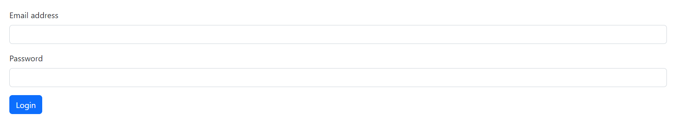

## Welcome page

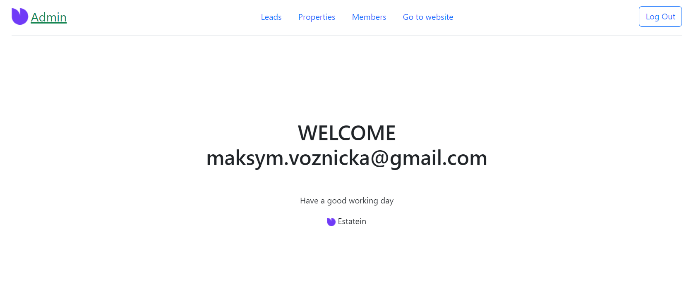

## Header

## Button to download a file with a list of client emails

## Table of unprocessed leads

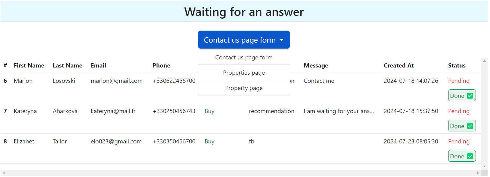

## All leads table

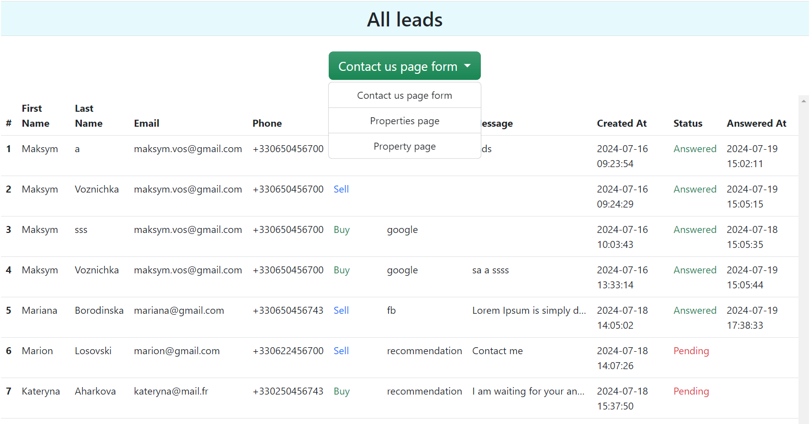

## Table of real estate displayed on the site

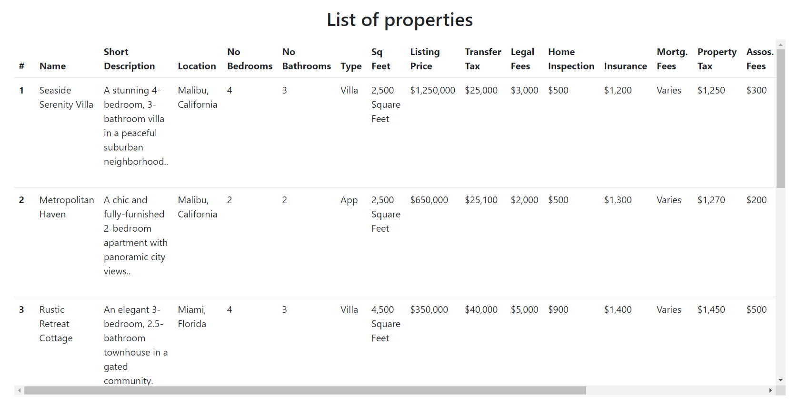

## Buttons when clicked on which a form appears with which you can edit real estate information

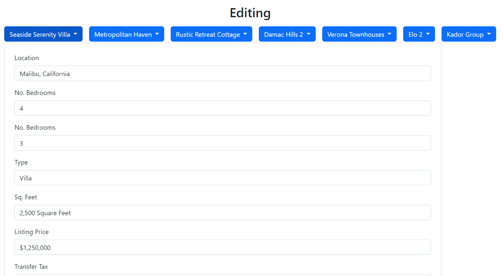

## Add property button

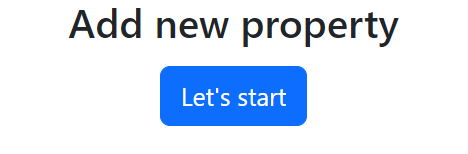

### After clicking the button, a form appears

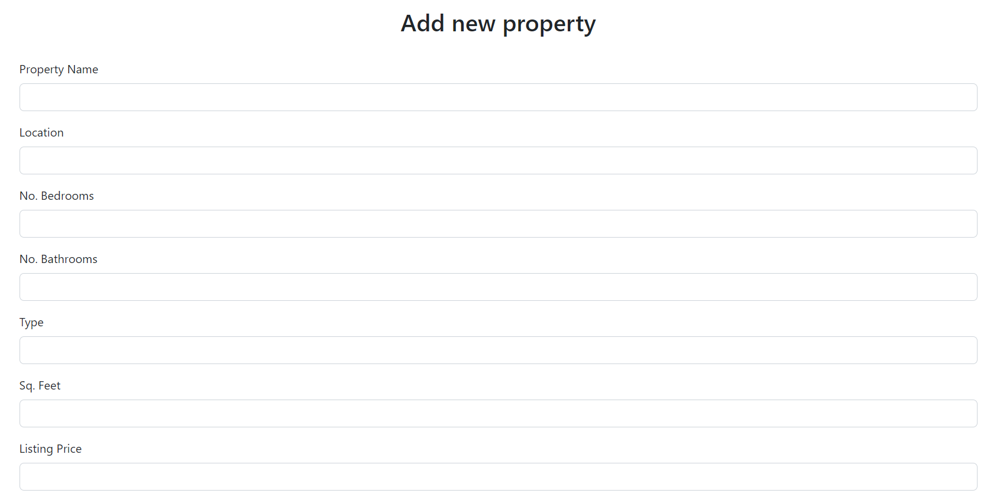

## Delete property

*Available only for the **admin** role*

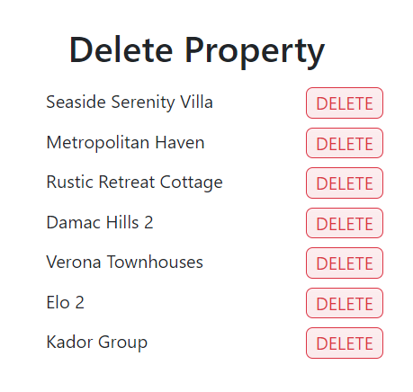

### After clicking the button, you are asked to confirm deletion

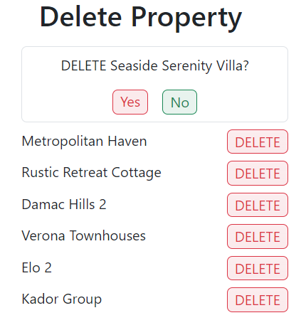

## Table with users who have access to site management

*For role **admin***

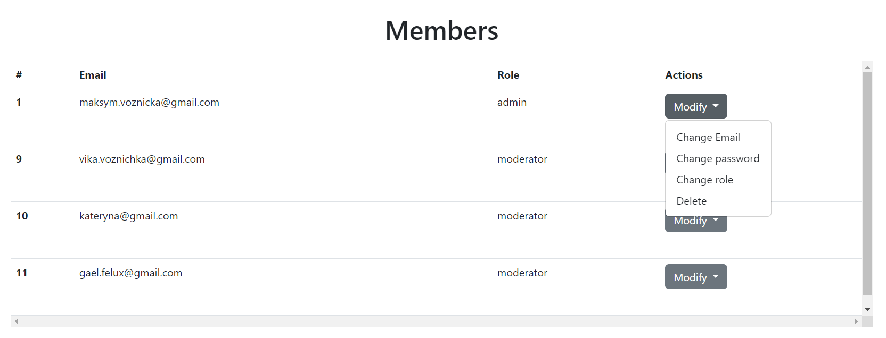

*For role **moderator***

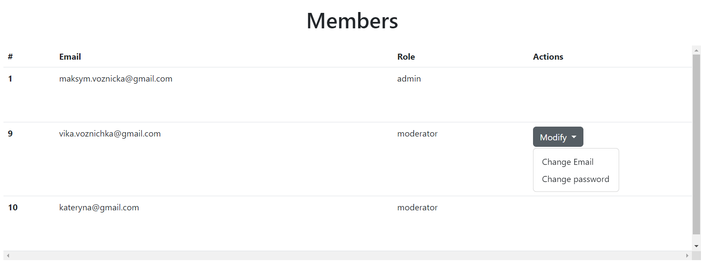

### Change email

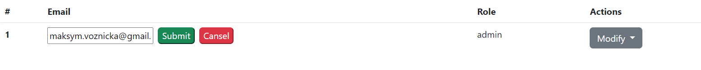

### Change password

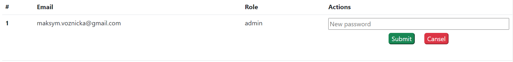

### Change role and delete user

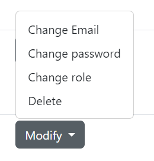
* When you click on "Change role" the role instantly changes from admin to moderator and vice versa.
* When you click "Delete", the user is deleted.

## Add user form

*Available only for the **admin** role*

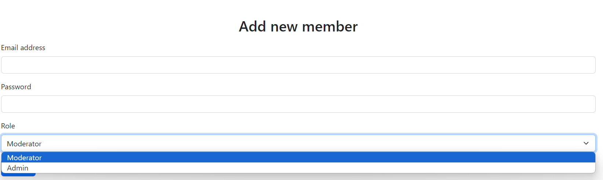

